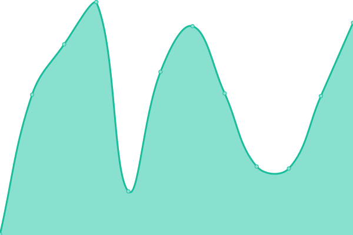
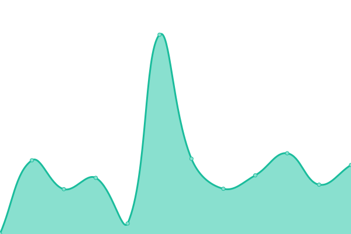
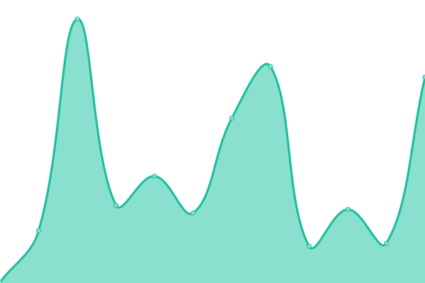

# [📈 Live Status](https://status.yami.ski): <!--live status--> **🟥 Complete outage**

This repository contains the open-source uptime monitor and status page for [yami.ski](https://hub.yami.ski/), powered by [Upptime](https://github.com/upptime/upptime).

With [Upptime](https://upptime.js.org), you can get your own unlimited and free uptime monitor and status page, powered entirely by a GitHub repository. We use [Issues](https://github.com/yamisskey/status.yami.ski/issues) as incident reports, [Actions](https://github.com/yamisskey/status.yami.ski/actions) as uptime monitors, and [Pages](https://status.yami.ski) for the status page.

<!--start: status pages-->
<!-- This summary is generated by Upptime (https://github.com/upptime/upptime) -->
<!-- Do not edit this manually, your changes will be overwritten -->
<!-- prettier-ignore -->
| URL | Status | History | Response Time | Uptime |
| --- | ------ | ------- | ------------- | ------ |
|  [Misskey](https://yami.ski) | 🟥 Down | [misskey.yml](https://github.com/yamisskey/status.yami.ski/commits/HEAD/history/misskey.yml) | 

 258ms
     
 | 

<a href="https://status.yami.ski/history/misskey">0.00%</a>
    

|  [Grafana](https://grafana.yami.ski) | 🟥 Down | [grafana.yml](https://github.com/yamisskey/status.yami.ski/commits/HEAD/history/grafana.yml) | 

 267ms
     
 | 

<a href="https://status.yami.ski/history/grafana">0.00%</a>
    

|  [CTF](https://ctf.yami.ski) | 🟥 Down | [ctf.yml](https://github.com/yamisskey/status.yami.ski/commits/HEAD/history/ctf.yml) | 

 218ms
     
 | 

<a href="https://status.yami.ski/history/ctf">0.00%</a>
    

|  [Element](https://element.yami.ski) | 🟥 Down | [element.yml](https://github.com/yamisskey/status.yami.ski/commits/HEAD/history/element.yml) | 

 223ms
     
 | 

<a href="https://status.yami.ski/history/element">0.00%</a>
    

|  [SearXNG](https://search.yami.ski) | 🟥 Down | [sear-xng.yml](https://github.com/yamisskey/status.yami.ski/commits/HEAD/history/sear-xng.yml) | 

 264ms
     
 | 

<a href="https://status.yami.ski/history/sear-xng">0.00%</a>
    

<!--end: status pages-->

[**Visit our status website →**](https://status.yami.ski)

## 📄 License

- Powered by: [Upptime](https://github.com/upptime/upptime)
- Code: [MIT](./LICENSE) © [Anand Chowdhary](https://anandchowdhary.com), supported by [Pabio](https://pabio.com)
- Data in the `./history` directory: [Open Database License](https://opendatacommons.org/licenses/odbl/1-0/)
